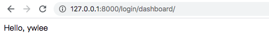

# DefaultUser
* check what default django provides us
* use sqlite3

# RewriteUser
* use psql
* rewrite `user model` (it is `main_myuser` in this example) and show it by a raw SQL query

```
                 List of relations
 Schema |          Name          | Type  |  Owner   
--------+------------------------+-------+----------
 public | auth_group             | table | Rosemary
 public | auth_group_permissions | table | Rosemary
 public | auth_permission        | table | Rosemary
 public | django_admin_log       | table | Rosemary
 public | django_content_type    | table | Rosemary
 public | django_migrations      | table | Rosemary
 public | django_session         | table | Rosemary
 public | main_myuser            | table | Rosemary
(8 rows)
```

```javascript
[{
	"id": 1,
	"password": "pbkdf2_sha256$120000$pUEcvklDV0tc$6KTTxCKlpvi4woQzTw0GuASlBh+CgtgOgLxxGsFZ+Y4=",
	"last_login": null,
	"email": "abc@gmail.com",
	"date_of_birth": "1985-04-14",
	"is_active": true,
	"is_admin": false
}]
```

# ExtendUser
* use psql
* extend `user model` (it is `main_myuser` in this example) with a new column `age` and show it by a raw SQL query

```
                    List of relations
 Schema |             Name             | Type  |  Owner   
--------+------------------------------+-------+----------
 public | auth_group                   | table | Rosemary
 public | auth_group_permissions       | table | Rosemary
 public | auth_permission              | table | Rosemary
 public | django_admin_log             | table | Rosemary
 public | django_content_type          | table | Rosemary
 public | django_migrations            | table | Rosemary
 public | django_session               | table | Rosemary
 public | main_myuser                  | table | Rosemary
 public | main_myuser_groups           | table | Rosemary
 public | main_myuser_user_permissions | table | Rosemary
(10 rows)
```

```javascript
[{
	"id": 1,
	"password": "pbkdf2_sha256$120000$dK0ZIkUyNiSc$u7xPX5YobEIy8cHcXWSakiPXtRaoI3gOdBKWyJaZ/nU=",
	"last_login": null,
	"is_superuser": true,
	"username": "root",
	"first_name": "",
	"last_name": "",
	"email": "root@abc.com",
	"is_staff": true,
	"is_active": true,
	"date_joined": "2020-06-08T07:17:44.931Z",
	"age": null
}]
```


# formSubmit


* use sqlite3
* basic login/logout/dashboard functionality with vanilla Django with better UI
* use form submit in frontend
* access control
```python
def hello(request):
    if request.user.is_authenticated: 
        return render(request, 'hello.html')
    else:
        return render(request, 'form_template.html')
```
* Redirect in the backend
```python
    if user is not None and user.is_active:
        print("Successful, redirect to hello...")
        auth.login(request, user)
        return HttpResponseRedirect('/hello/')
    else:
        print("user not exist... redirect to signin page...")
        return render(request, 'form_template.html')
```
* By default, it will have a `sessionid` in `cookies` after login


# customCmsPage


* use psql
* most basic login/logout/dashboard functionality with vanilla Django
* use `LoginView.as_view`
* the `admin` page is not accessible by removing `admin/` from `url.py` 


# cookieBasedAuth


* use sqlite3
* use jQuery/Bootstarp/Django base template in frontend
* access control
```python
@require_http_methods(["GET"])
@login_required(login_url='/signin/')
def hello(request):
    return render(request, "hello.html")
```
* Redirect in the frontend
```javascript
$.ajax({
  type: "POST",
  url: "http://127.0.0.1:8000/dosignin/",
  data: $(this).serialize(),
  success: function (data) {
    $("#signinModal").modal("hide");

    // by default, it will have a sessionid in cookies
    window.location.href = "http://127.0.0.1:8000/";
  },
  error: function (xhr, textStatus, errorThrown) {
    $('#message').text(`${textStatus}: [${xhr.status}] ${errorThrown}`);
  },
});
```
* In the backend, it is basic the same as `formSubmit` project

* In `settings.py`, a cookie with the HttpOnly attribute is inaccessible to the JavaScript Document
```python
SESSION_ENGINE = "django.contrib.sessions.backends.signed_cookies"
SESSION_COOKIE_HTTPONLY = True
SESSION_COOKIE_AGE = 60
```

* It will have a `sessionid` in `cookies` after login


* It the `sessionid` will expired after 60 seconds


# loginLimit
* use sqlite3
* use django-axes

# djangoRest
## helloDjangoRest

# cms
* psql
* frontend routing 
* bootstrap template

# multiLevelUser
* psql
* frontend routing 
* bootstrap template
* 404 page

* use `staff_member_required`
```python
@require_http_methods(["GET"])
@login_required(login_url='/signin/')
@staff_member_required(login_url='/notfound/')
def visualization(request):
    return render(request, "visualization.html", {
        "ACCOUNTNAME": request.user,
        "PAGEID": "visualization"
    })
```

* login decision
```python
@require_http_methods(["GET"])
@login_required(login_url='/signin/')
def index(request):
    if request.user.is_staff:
        return redirect('/myadmin/')
    else:
        return redirect('/client/')
```


