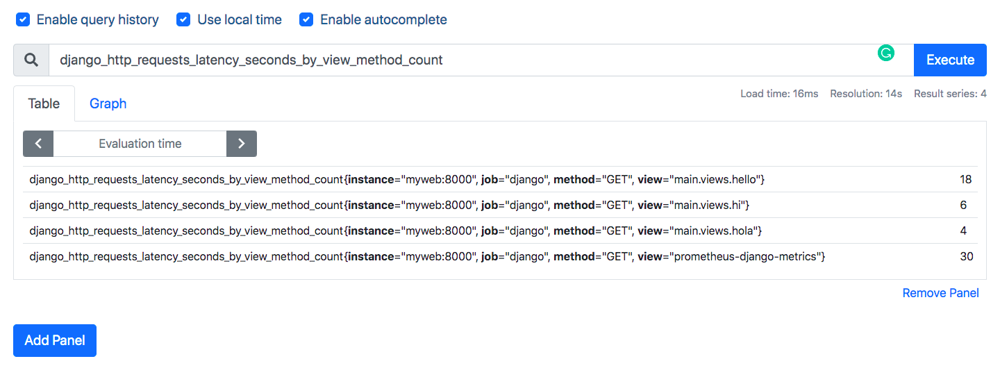

# Note
* customize UI does not work!!

# How 
```
docker-compose build
docker-compose up
```

## get into prometheus
```
docker exec -it {container_id} /bin/sh
```

# what to add

```
django_http_requests_latency_seconds_by_view_method_count
```


# Ref
* [django prometheus](https://github.com/korfuri/django-prometheus)
* [prometheus](https://prometheus.io/docs/prometheus/latest/installation/)
* [docker-compose](https://github.com/vegasbrianc/prometheus/blob/master/docker-compose.yml)